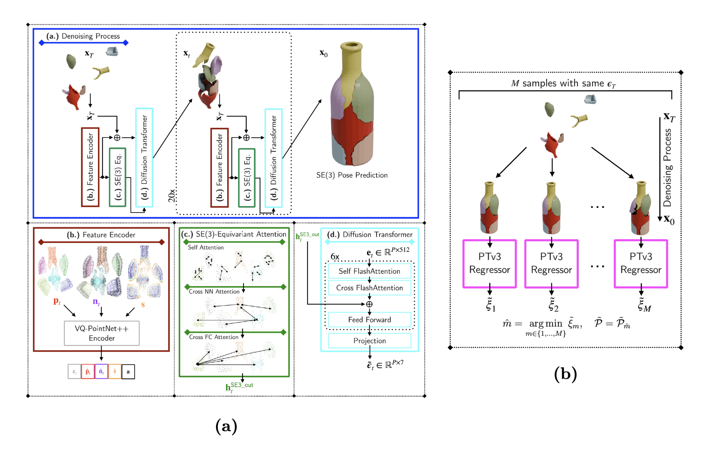
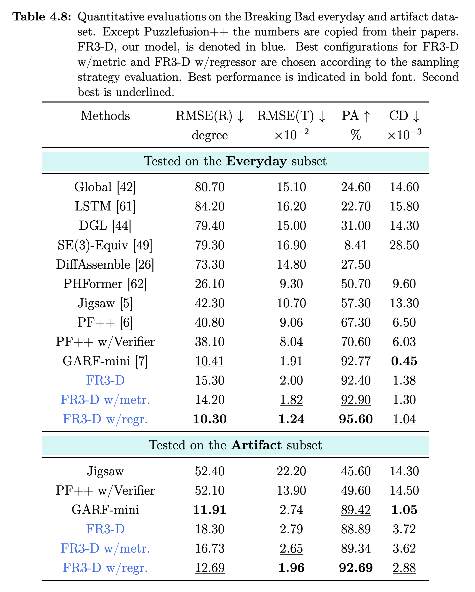

<h2 align="center"> FR3-D: A Regressor-Guided   SE(3)-Equivariant conditioned Diffusion Model   for 3D Fracture Reassembly
</h2>

[Cederic Aßmann](https://github.com/cederican)

Technical University Berlin

Berlin Learning and Intelligent Systems Lab

[Project page](https://cederican.github.io/FR3-D/), [Thesis](https://github.com/cederican/FR3-D/releases/download/Thesis/Abschlussarbeit_500161.pdf) 

  </a> 

## Table of Contents

- [Introduction](#introduction)
- [Installation](#installation)
- [Data preparation](#data-preparation)
- [Getting started](#getting-started)
- [Citation](#citation)
- [License](#license)

## Introduction

(a) The pretrained VQ-PointNet++ Encoder is used to provide additional input features besides the noisy translation and rotation vector $\mathbf{x}_t$ to the denoiser. SE(3)-Equivariant Attention module can be used as further conditioning of the denoiser. The final pose prediction $\mathbf{x}_0$ is acquired according to the noise scheduler settings. (b) The reassembly quality estimation regressor ranks the quality of pose predictions from the denoiser supervised by combined ground truth metric scalar scores $\xi_m$.

Extensive experiments on the Breaking Bad dataset show that FR3-D in combination with the reassembly quality estimation regressor outperforms in particular the PuzzleFusion++ framework by a large margin but also GARF-mini in three out of four performance metrics.

## Installation

Please refer to the [installation guide](docs/installation.md) to set up the environment.

## Data preparation

Please refer to the [data preparation guide](docs/data_preparation.md) to download and prepare for the BreakingBad dataset, as well as downloading our pre-trained model checkpoints.

## Getting started

Please follow the [test guide](docs/test.md) for model inference, evaluation, and visualization.

Please follow the [training guide](docs/training.md) for details about the training pipeline.

## Acknowledgements

The FR3-D framework is deeply inspired by [PuzzleFusion++](https://github.com/eric-zqwang/puzzlefusion-plusplus) and leverages ideas from [Jigsaw](https://github.com/Jiaxin-Lu/Jigsaw) and [GARF](https://github.com/ai4ce/GARF). We benefited from their open-source code. Please consider reading these papers if interested in relevant topics. We gratefully acknowledge the Charité Universitätsmedizin for access to curated healthy and fractured CT Tibia Bones.

## License

This project is licensed under GPL, see the [license file](LICENSE) for details.
